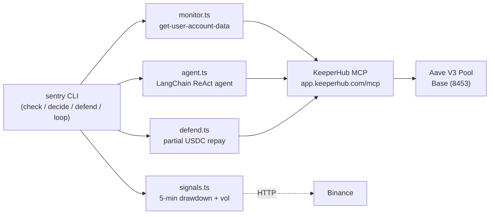

# Sentry — Autonomous Position-Risk Agent

Sentry monitors your Aave V3 health factor on Base and executes defensive partial repays through [KeeperHub MCP](https://docs.keeperhub.com/ai-tools/mcp-server). Every onchain action goes through KeeperHub — no custom transaction paths.

## Architecture



## Reasoning layer (LangChain)

- `signals.ts` — pulls 5-min ETH/USDC candles (Binance) and computes **drawdown %** (fall from 5-min peak) and **volatility %**.
- `agent.ts` — a LangChain ReAct agent (`createReactAgent`) with three tools that all route through KeeperHub: `get_aave_account_data`, `get_price_signal`, and `execute_protocol_action` (the only onchain path). It returns a structured decision `{risk, action, amountUsdc, reasons, confidence}` plus its full tool-call trace.
- `decide.ts` — deterministic fallback when no `OPENAI_API_KEY`/`ANTHROPIC_API_KEY` is set.

Decision rule: `HF <= 1.05` → repay immediately. `HF < threshold` **and** drawdown ≥ 3% → partial repay (real cascade risk). `HF < threshold` with tiny drawdown → hold (noise, don't burn gas).

## Phase 1 Core Loop

1. **check** — read health factor via `aave-v3/get-user-account-data`
2. **decide** — LangChain agent reasons over HF + price signals (dry-run by default)
3. **defend** — partial USDC repay via `aave-v3/repay` when HF drops
4. **loop** — poll every 60s; on breach, agent decides, then executes via KeeperHub

## Setup

### 1. KeeperHub account

1. Sign up at [app.keeperhub.com](https://app.keeperhub.com)
2. Create an org-scoped API key (`kh_` prefix) under **Settings → API Keys → Organisation**
3. Connect a wallet integration (required for write actions like repay)

### 2. Fund wallet on Base

- Send ETH on Base for gas
- Hold USDC for repay actions (`0x833589fCD6eDb6E08f4c7C32D4f71b54bdA02913`)
- Approve USDC spending for the Aave V3 Pool contract

### 3. Open an Aave V3 position

Supply collateral and borrow on [Aave V3 Base](https://app.aave.com/?marketName=proto_base_v3) so Sentry has a health factor to monitor.

### 4. Configure environment

```bash
cp .env.example .env
# Edit .env with your KH_API_KEY and USER_ADDRESS
```

| Variable | Description |
| --- | --- |
| `KH_API_KEY` | KeeperHub org API key (`kh_…`) |
| `USER_ADDRESS` | Wallet with the Aave position |
| `HF_THRESHOLD` | Repay trigger (default `1.25`) |
| `REPAY_AMOUNT_USDC` | Partial repay size (default `5`) |
| `NETWORK` | Chain ID (default `8453` = Base) |

### 5. Install and run

```bash
npm install
npm run check    # print current HF status
npm run decide   # LangChain agent: reason over HF + signals, dry-run decision
npm run defend   # force a partial USDC repay
npm run loop     # monitor every 60s, agent defends once if HF < threshold
```

## Phase 3 — Paid x402 risk-check

Publish the risk-check as a marketplace workflow, then pay-per-call over x402 (Base USDC) / MPP (Tempo USDC.e).

```bash
npm run publish     # create + list "sentry-risk-check" workflow at $0.01/call
npm run paycheck    # call it; on HTTP 402, capture the x402 challenge and settle
```

- `publish.ts` builds the workflow (Manual trigger → `aave-v3/get-user-account-data` → code decision node), publishes via `list_workflow`, and prints the per-workflow MCP + REST call URLs.
- `paycheck.ts` posts to `/api/mcp/workflows/{slug}/call`. A paid workflow returns `HTTP 402` with an x402 challenge; set `KH_WALLET_MCP_URL` to a remote `@keeperhub/wallet` MCP server to auto-pay (`call_workflow` tool) or settle manually.

## Phase 4 — Reliability & audit trail

```bash
npm run executions            # list recent KeeperHub executions
npm run audit -- <execId>     # render trigger → decision → tx → outcome to stdout + audit.md
npm run stage-failure         # create + run a low-gas repay workflow to exercise simulation/retry
```

- `audit.ts` pulls `get_execution` (status + per-step logs) and renders the full chain, including `gasUsed`, `effectiveGasPrice`, tx hashes and timestamps — the "reliability and observability" evidence.
- `stage-failure` deliberately under-funds gas on the repay action so you can narrate KeeperHub's simulation-before-submit / retry / backoff from the audit log. For a real gas-spike demo, run `npm run defend` during a congestion window, then `npm run audit` the run.

## Phase 1 Demo

```bash
# 1. Verify position health
npm run check

# 2. Start the monitoring loop
npm run loop

# 3. (Optional) Manually trigger a repay
npm run defend
```

Expected `check` output:

```json
{
  "hf": 1.85,
  "totalDebtBase": 1200.5,
  "totalCollateralBase": 2500.0,
  "threshold": 1.25
}
```

## Notes

- Action slugs (`aave-v3/get-user-account-data`, `aave-v3/repay`) should be confirmed at runtime via `search_protocol_actions` if KeeperHub updates them.
- Sentry uses KeeperHub MCP exclusively — no direct RPC or wallet signing in this repo.
